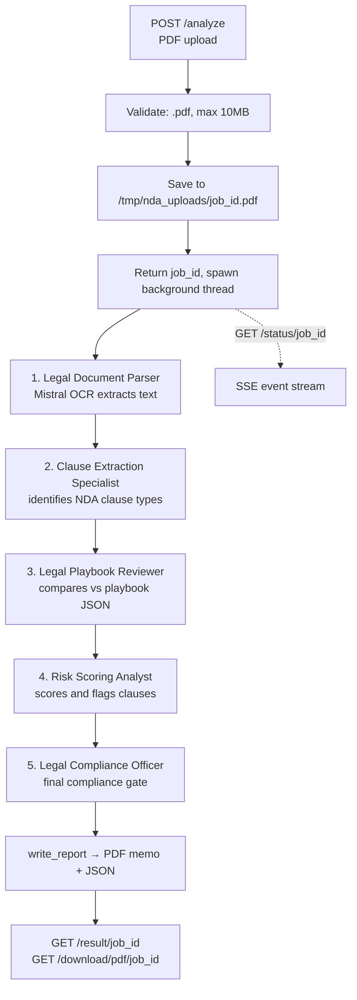

# agentopslab-api

FastAPI service wrapping a CrewAI 5-agent NDA review pipeline; SSE progress, PDF memo output.


## What This Does

Accepts an NDA as a PDF upload and runs it through a five-agent CrewAI pipeline that
extracts clauses, compares them against a legal playbook, scores risk, and issues a
compliance verdict. Progress streams back per agent over Server-Sent Events, and the
finished review is available as JSON or a generated PDF memo.

This is a single-purpose NDA review service, not a general agent platform. The pipeline
is hardcoded — there is no way to register a different crew or add agents via config.

## How It Works



The five agents run sequentially via `Process.sequential`, each task's output feeding the
next. `POST /analyze` returns immediately with a `job_id`; the pipeline runs in a daemon
thread while `GET /status/{job_id}` polls the job's event list every 0.5s and yields new
events as SSE. Job state lives in a module-level `jobs` dict.

Text extraction uses Mistral OCR (`mistral-ocr-latest`), which handles scanned and
handwritten PDFs as well as digital ones. All five agents call
`anthropic/claude-sonnet-4-20250514`.

### Endpoints

| Method | Path | Description |
|---|---|---|
| `GET` | `/` | Health check |
| `POST` | `/analyze` | Upload a PDF, returns `job_id` |
| `GET` | `/status/{job_id}` | SSE stream of agent progress |
| `GET` | `/result/{job_id}` | Final verdict JSON (`202` if still running) |
| `GET` | `/download/pdf/{job_id}` | Generated PDF memo |

## Quickstart

1. Clone and enter the repository:
   ```bash
   git clone https://github.com/vinaygangidi/agentopslab-api.git
   cd agentopslab-api
   ```

2. Create a virtual environment and install dependencies:
   ```bash
   python3 -m venv .venv
   source .venv/bin/activate
   pip install -r requirements.txt
   ```

3. Create a `.env` file in the repository root:
   ```bash
   cat > .env <<'EOF'
   ANTHROPIC_API_KEY=sk-ant-...
   MISTRAL_API_KEY=...
   ALLOWED_ORIGIN=http://localhost:3000
   EOF
   ```

4. Supply the legal playbook at `playbooks/nda_playbook.json`. **[PLACEHOLDER]** — this
   file is not in the repository. It must be a JSON object with a `clauses` array. Without
   it the pipeline still completes, but the playbook step falls back to the model's own
   legal judgment instead of your standards.

5. Run the service:
   ```bash
   uvicorn main:app --reload --port 8000
   ```

6. Submit an NDA:
   ```bash
   curl -F "file=@your-nda.pdf" http://localhost:8000/analyze
   curl -N http://localhost:8000/status/<job_id>
   ```

### Docker

```bash
docker build -t agentopslab-api .
docker run -p 8000:8000 --env-file .env agentopslab-api
```

Note the Dockerfile hardcodes `--port 8000` and does not read `$PORT`.

### CLI

`nda_review/crew.py` has its own entry point that bypasses the API:

```bash
python nda_review/crew.py --contract path/to/nda.pdf
python nda_review/crew.py --all      # every PDF in test-data/ndas/
```

## Configuration

| Name | Required | Default | Description |
|---|---|---|---|
| `ANTHROPIC_API_KEY` | Yes | none | Claude API key for all five agents. The CLI exits with status 1 if unset; the API path does not check it, so a missing key surfaces as a pipeline error event |
| `MISTRAL_API_KEY` | Yes | none | Mistral OCR key for PDF text extraction. Raises `ValueError` when the client initializes |
| `ALLOWED_ORIGIN` | No | `https://agentopslab-landing.vercel.app` | CORS origin. `http://localhost:3000` is always appended |
| `PORT` | No | `8000` | Only read when running `python main.py` directly. Ignored by the Dockerfile |

## Limitations

- **Job state is in-memory.** `jobs` is a plain dict, so all job history is lost on
  restart, is not shared across workers, and is never evicted — a long-running instance
  grows in memory without bound. Do not run this with more than one worker.
- **The NDA playbook is not in the repository.** `playbooks/nda_playbook.json` is
  referenced but absent. The playbook step degrades to the model's general legal knowledge,
  which means results do not reflect any specific company's standards.
- **No tests.** No test suite, no CI, no verification of the risk scoring or compliance gate.
- **Agent model labels in the API are wrong.** `AGENT_STEPS` in `main.py` reports "Haiku"
  for steps 1, 2, and 5 and "Sonnet" for 3 and 4, but `crew.py` assigns
  `claude-sonnet-4-20250514` to all five agents. The labels are display strings only and
  do not affect execution.
- **SSE progress is simulated, not observed.** A `progress_monitor` thread emits
  `agent_start` events from the static `AGENT_STEPS` list and advances on task callbacks.
  It does not hook CrewAI's internal agent lifecycle, so reported progress can drift from
  what the crew is actually doing.
- **Uploads and reports go to `/tmp`.** `/tmp/nda_uploads` and `/tmp/nda_outputs` are
  ephemeral on most container hosts, so generated memos disappear on restart. Uploaded
  NDAs are never deleted during the process lifetime.
- **Legal document contents are sent to third parties.** Every uploaded NDA is
  transmitted to the Mistral API for OCR and to the Anthropic API for analysis. Do not
  upload contracts whose terms prohibit third-party processing.
- **Errors are returned verbatim.** The pipeline's catch-all pushes `str(e)` into the
  event stream, which can expose internal paths or API error details to the client.
- **`POST /analyze` trusts the client-reported size.** The 10MB check reads
  `file.size` before the body is consumed, and the extension check is a plain
  `.endswith(".pdf")` — no content-type or magic-byte validation.
- **No authentication.** Any caller who can reach the service can upload documents and
  read any job's results by `job_id`.
- **Dead code in `run_pipeline`.** Unused monkey-patch scaffolding (`original_execute`,
  `_original_execute`, re-imports of `build_agents`/`build_tasks`) is assigned and never
  used.

## License

MIT — see [LICENSE](LICENSE).
